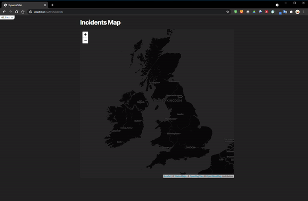

# README

Example cobbled-together project using leaflet.js and ActionCable. When new data is broadcast using ActionCable, a marker is added to the map, the view flys to the marker and a popup appears next to the marker.




### Requirements
* Ruby 2.7
* Rails 6
* Redis
* sqlite3

### Setup
```
bundle install
yarn install
bundle exec rails s
```
Visit http://localhost:3000/incidents

### Example incident broadcasts (run in rails console):

```ruby
ActionCable.server.broadcast("incidents", {lat: 51.5, lon: -0.09, start: "#{Date.today.strftime('%d/%m/%Y')} 15:32", reference: "#{rand(1000..99999)}", location: "Pilgrimage Street", circuits: rand(1..30), customers: rand(50..1500)})
```

```ruby
ActionCable.server.broadcast("incidents", {lat: 52.62, lon: 1.3, start: "#{Date.today.strftime('%d/%m/%Y')} 10:14", reference: "#{rand(1000..99999)}", location: "Carrow Road", circuits: rand(1..30), customers: rand(50..1500)})
```